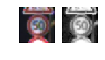
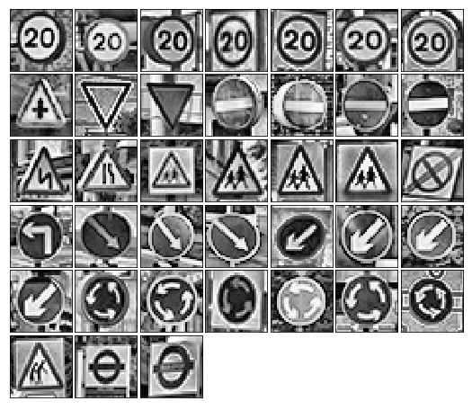
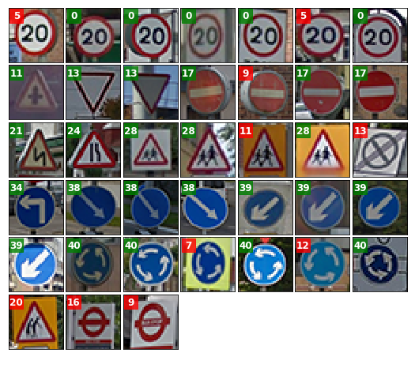
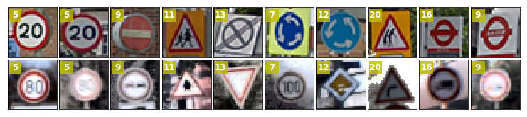
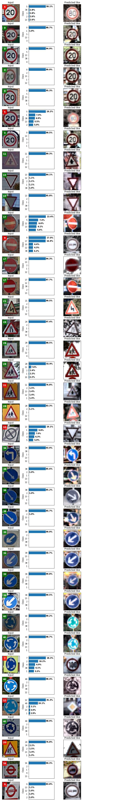
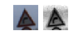
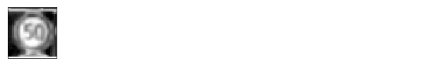
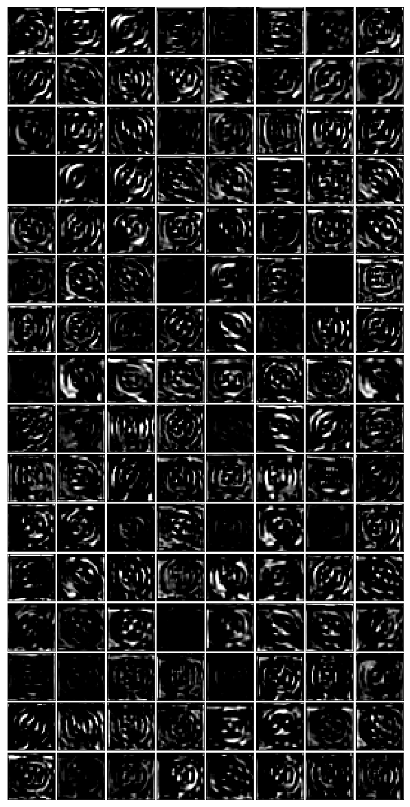
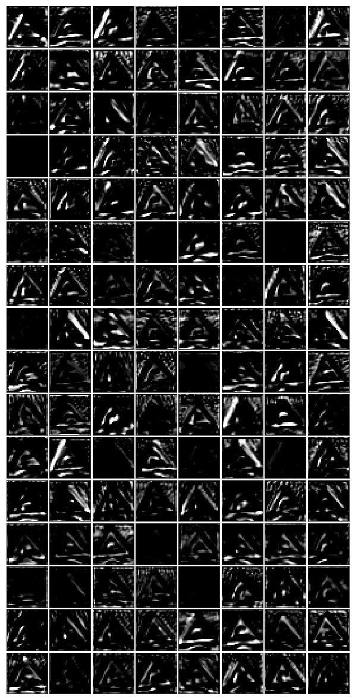

# Project: Build a Traffic Sign Recognition Program

[//]: # (Link References)

[signnames]: https://github.com/udacity/CarND-Traffic-Sign-Classifier-Project/blob/master/signnames.csv

[//]: # (Image References)

[class_frequencies]: ./images/class_frequencies.png "Visualization"
[image_train]: ./images/train_sample.png "Sample of training images"
[image_preprocessing]: ./images/preprocessed.png "Preprocessed images"
[image_sharpening]: ./images/sharpening.png "Sharpening"
[image_augmentation]: ./images/augmented.png "Augmented"
[transformer_1]: ./images/transformer_1.png "Transformer output"
[image_training_progress]: ./images/training_progress.png "Training progress"
[image_extra_signs]: ./images/extra_signs.png

## Overview

This is my attempt to the Traffic Sign Classifier Project, second assignment in the [Udacity Self-Driving Car Nanodegree program](https://www.udacity.com/course/self-driving-car-engineer-nanodegree--nd013). The instructions for the assignment are publicly [available in github](https://github.com/udacity/CarND-Traffic-Sign-Classifier-Project). You can find my project code in the attached notebook.

Here I will consider the [rubric points](https://review.udacity.com/#!/rubrics/481/view) individually and describe how I addressed each point in my implementation.

## Data Set Summary & Exploration

The dataset provided is a preprocessed version of the [German Traffic Sign Dataset](http://benchmark.ini.rub.de/?section=gtsrb&subsection=dataset) where all the RGB images has been scaled to `32×32` pixels. The dataset comes already split for training, validation and testing.

A basic summary of the dataset is provided in the 10th input cell of the notebook.

* The size of training set is `34799`.
* The size of the validation set is `4410`.
* The size of the testing set is `12630`.
* The shape of a traffic sign image is `(32, 32, 3)`.
* The number of unique classes/labels in the data set is `43`.
* The file [signnames.csv][signnames] provides a human description for each class.

Now we briefly explore the dataset.

The next image is a bar chart (made with the help of `pandas` and `matplotlib`, see the 11th input cell in the notebook) showing the class distribution of the 3 datasets. The representation of the classes is imbalanced. This could represent an aspect of the reality where some traffic signs are much less frequent than others or a bias in the dataset. In any case, some classes of signs are under-represented and the models may have trouble to learn them. One solution to this problem is augment the dataset to balance the classes. I will come back to this later.

![Class frequency][class_frequencies]

The next figure is a random sample of all the 43 classes (code in 13th input cell). We can observe significant differences in the illumination. If we can reduce this variance One way to tackle this is to preprocess the data to normalize the contrast. I will come back to this in the next point. There are also differences in the size and orientation of the signs but they are mostly centered in the images, hence I expect those to be a minor obstacles compared with the illumination.

![Random sample of all the classes in the training dataset][image_train]

## Design and Test a Model Architecture

### 1. Preprocessing

The 16th input cell contains the code for the preprocessing.

In the preprocessing I decided to go with grayscale images because I didn't see an improvement using color images and working only with the luminance channel requires less resources.

Second I normalize the contrast. I tried with [global]((https://en.wikipedia.org/wiki/Histogram_equalization)) and local histogram equalization ([CLAHE](https://en.wikipedia.org/wiki/Adaptive_histogram_equalization)) and went with the last one in this model because it gives slightly better results.

Here is an example of preprocessed images: an obvious improvement in the contrast.

![Sample of preprocessed images][image_preprocessing]

I also considered a sharpening filter:
```python
kernel = np.array([[ 0,-1, 0],
                   [-1, 5,-1],
                   [ 0,-1, 0]])
for i in range(im.shape[-1]):
    im[:,:,i] = cv2.filter2D(im[...,i], -1, kernel)
```                   
This gives images like the following:

![Sharpening][image_sharpening]

However I didn't see an obvious improvement and decided not to include to avoid another source of noise.

Last step, I center the data around the origin and scale to the range `[-1,1]`. I do it subtracting `128` instead of computing the mean of each image for simplicity and robustness because the mean is affected by outliers. Other more powerful methods of normalization exist. Particularly I would have gone with [whitening](https://en.wikipedia.org/wiki/Whitening_transformation) but apparently this is not used with Convolutional Networks (see https://cs231n.github.io/neural-networks-2/).

#### Data Augmentation

To fight the imbalance in the dataset and the small amount of samples in general, I consider to augment the data applying random warps (affine and perspective transformations) to random samples of the original data. I wrote this code using `opencv`:

```python
class RandomWarp:
    """Apply a random affine + perspective transformation to an image."""

    def __init__(self, shift_range, scale_range, rotation_range, projection_scale):
        self.shift_range = shift_range
        self.scale_range = scale_range
        self.rotation_range = rotation_range
        self.projection_scale = projection_scale

    def pick_random_in_range(self, in_range):
        return random.uniform(in_range[0], in_range[1])

    def __call__(self, src_array):
        dst_array = np.zeros_like(src_array)
        n, rows, cols = src_array.shape[:3]
        for i, src in enumerate(src_array):
            # Rotation
            angle = self.pick_random_in_range(self.rotation_range)
            scale = self.pick_random_in_range(self.scale_range)
            cx = cols/2 + self.pick_random_in_range(self.shift_range)
            cy = rows/2 + self.pick_random_in_range(self.shift_range)
            M = cv2.getRotationMatrix2D((cx, cy), angle, scale)

            # Translation
            tx = self.pick_random_in_range(self.shift_range)
            ty = self.pick_random_in_range(self.shift_range)
            M[:, 2] += (tx, ty)

            dst = cv2.warpAffine(src, M, (cols, rows), borderMode=cv2.BORDER_REFLECT)

            if self.projection_scale:
                pts1 = np.float32([[0, 0], [cols, 0], [0, rows], [cols, rows]])
                pts2 = np.float32(pts1 + np.random.normal(0, self.projection_scale, (4, 2)))
                M = cv2.getPerspectiveTransform(pts2, pts1)
                dst = cv2.warpPerspective(dst, M, (cols, rows), borderMode=cv2.BORDER_REFLECT)

            if dst.ndim < src.ndim:
                dst = dst[..., np.newaxis]
            dst_array[i] = dst
        return dst_array

def augment_dataset(dataset, perturbation, fix_class_size, percent_original):
    """Augment and balance a dataset with random perturbations."""
    features, labels = dataset

    # Not include the original
    augmented_x = []
    augmented_y = []

    for label in sorted(np.unique(labels)):
        label_mask = labels == label
        label_count = label_mask.sum()

        original_count = min(int(fix_class_size * percent_original + .5), label_count)
        x = features[label_mask][np.random.choice(np.arange(label_count), original_count, replace=False)]
        y = np.ones(original_count, dtype=labels.dtype) * label
        augmented_x.append(x)
        augmented_y.append(y)

        num_new_samples = fix_class_size - original_count

        x = features[label_mask][np.random.choice(np.arange(label_count), num_new_samples)]
        x = perturbation(x)

        y = np.ones(num_new_samples, dtype=labels.dtype) * label

        augmented_x.append(x)
        augmented_y.append(y)

    augmented_x = np.row_stack(augmented_x)
    augmented_y = np.concatenate(augmented_y)
    return augmented_x, augmented_y
```

With the help of `augment_dataset` the original dataset could be extended at the same time we balance the classes. For example, using the following code we can generate a train dataset with 3000 images per class (a total of 129000 samples but still a small dataset) keeping at most a 50% of the original data if enough data is available.

```python
perturbation = RandomWarp(shift_range=(-2,2),
                          scale_range=(.9,1.1),
                          rotation_range=(-10,10),
                          projection_scale=None)

# The size of the larger class is 2000...
augmented_dataset = augment_dataset(training_dataset, perturbation, fix_class_size=3000, percent_original=.5)
```
This is an example of the augmented data:

![Augmented data][image_augmentation]

However, this method is still not perfect and I didn't want to expend a lot of time preprocessing and augmenting the data preferring to invest the time in the architecture of the Convolutional Network.

#### 2. Describe how, and identify where in your code, you set up training, validation and testing data. How much data was in each set? Explain what techniques were used to split the data into these sets.

The data comes already split in training, validation and testing and I didn't take any extract action on this. If a validation data wouldn't be available I would have split the training dataset taking at least 20% for validation keeping the proportion per class (stratified split) so we won't introduce a new imbalance. With the help of `scikit-learn` it's a no-brain operation:

```python
from sklearn.model_selection import train_test_split
X_train, X_valid, y_train, y_valid = train_test_split(X_train, y_train, test_size=.2, stratify=y_train)
```

In any case, the final datasets after the preprocessing have these shapes:

| Dataset       | Transformation    | Shape              |
|:-------------:|:-----------------:|:------------------:|
| Training      | preprocessed      | (34799, 32, 32, 1) |
| Validation    | preprocessed      | (4410, 32, 32, 1)  |
| Testing       | preprocessed      | (12630, 32, 32, 1) |


#### 3. Describe, and identify where in your code, what your final model architecture looks like including model type, layers, layer sizes, connectivity, etc.) Consider including a diagram and/or table describing the final model.

[slim]: https://github.com/tensorflow/tensorflow/tree/master/tensorflow/contrib/slim

The code for my final model is located in the 24th input cell of the notebook. It looks like this thanks to [slim][slim]:

```python
import tensorflow.contrib.slim as slim

net = inputs
net = slim.dropout(net, .9, is_training=is_training, scope='dropout0')

with slim.arg_scope([slim.conv2d, slim.max_pool2d], padding='SAME'):

    net = spatial_transformer_layer(net, downsample=1, is_training=is_training, scope='transformer')

    with slim.arg_scope([slim.conv2d, slim.fully_connected],
                        activation_fn=None,
                        weights_initializer=slim.xavier_initializer(),
                        weights_regularizer=slim.l2_regularizer(params.get('l2_regularizer', 0.005)),                                
                        normalizer_fn=slim.batch_norm,
                        normalizer_params=dict(decay=0.9, activation_fn=tf.nn.relu, updates_collections=None, is_training=is_training, scope='bn')):

        net = slim.repeat(net, 3, slim.conv2d, 128, 3, scope='conv1')
        net = slim.max_pool2d(net, (2,2), scope='pool1')

        net = slim.dropout(net, .9, is_training=is_training, scope='dropout1')

        net = slim.repeat(net, 3, slim.conv2d, 256, 5, scope='conv2')
        net = slim.max_pool2d(net, (2,2), scope='pool2')

        net = slim.dropout(net, .7, is_training=is_training, scope='dropout2')

        net = slim.repeat(net, 3, slim.conv2d, 512, 3, scope='conv3')
        net = slim.max_pool2d(net, (2,2), scope='pool3')

        net = slim.dropout(net, .5, is_training=is_training, scope='dropout3')

        net = slim.flatten(net)

        net = slim.fully_connected(net, 1024, scope='fc4')

        net = slim.fully_connected(net, 512, scope='fc5')

        net = slim.dropout(net, .5, is_training=is_training, scope='dropout4')

        net = slim.fully_connected(net, params['n_classes'], activation_fn=None, scope='logits')
```

We can expand the layers in a table:

| Layer         		|     Description	                    |
|:---------------------:|:-------------------------------------:|
| Input         		| 32x32x1 Grayscale image               |
| Dropout               | 90% keep probability                  |
| Spatial Transformer   | See https://arxiv.org/abs/1506.02025  |
| Convolution 3x3       | 1x1 stride, same padding, 128 filters |
| RELU					|                                       |
| Convolution 3x3       | 1x1 stride, same padding, 128 filters |
| RELU					|                                       |
| Convolution 3x3       | 1x1 stride, same padding, 128 filters |
| RELU					|                                       |
| Max pooling	      	| 2x2 stride                            |
| Dropout               | 90% keep probability                  |
| Convolution 3x3       | 1x1 stride, same padding, 256 filters |
| RELU					|                                       |
| Convolution 3x3       | 1x1 stride, same padding, 256 filters |
| RELU					|                                       |
| Convolution 3x3       | 1x1 stride, same padding, 256 filters |
| RELU					|                                       |
| Max pooling	      	| 2x2 stride                            |
| Dropout               | 70% keep probability                  |
| Convolution 3x3       | 1x1 stride, same padding, 512 filters |
| RELU					|                                       |
| Convolution 3x3       | 1x1 stride, same padding, 512 filters |
| RELU					|                                       |
| Convolution 3x3       | 1x1 stride, same padding, 512 filters |
| RELU					|                                       |
| Max pooling	      	| 2x2 stride                            |
| Dropout               | 50% keep probability                  |
| Fully Connected       | 1024 outputs                          |
| Fully Connected       | 512 outputs                           |
| Dropout               | 50% keep probability                  |
| Softmax				| _                                     |

Some comments.

After the input layer I introduce a differentiable module described in this [paper](https://arxiv.org/abs/1506.02025) to give to the network the ability to learn invariance to translation, scale and rotation simplifying the task of the rest of the network. The implementation comes from https://github.com/tensorflow/models/tree/master/transformer and I adapt it to TensorFlow 1.0 (cells 22 and 23). As an example of the effect of this module, if we input this image (original and preprocessed) to the network:



once trained, the output of the transformer is a scaled an centered version of the original:

![Output][transformer_1]

To initialize the weights I use _Xavier initialization_ which preserves the variance of the output of each layer constant, keeping the signal through the network from exploding or dropping to zero ([original paper](http://jmlr.org/proceedings/papers/v9/glorot10a/glorot10a.pdf), or [shorter explanation](https://prateekvjoshi.com/2016/03/29/understanding-xavier-initialization-in-deep-neural-networks/)).

I also use _batch normalization_ (see [paper](https://arxiv.org/abs/1502.03167)), _L2 regularization_ and _dropouts_ to fight overfitting. I do this mostly as a technical exercise on TensorFlow because given the small amount of training data and the constrains in time and resources to model and train a big network (or a big augmented dataset) it's going to be impossible not to overfit with a model of this complexity.

#### 4. Describe how, and identify where in your code, you trained your model.

The code for training and evaluating the model is located under the 1.5.3  Train, Validate and Test the Model section of the notebook, cells 26 to 29.

I use an [_Adam optimizer_](https://arxiv.org/abs/1412.6980) with a _decaying learning rate_ and an _early stopping_ mechanism that stops the trainer when the loss doesn't improve for a number of epochs. The most relevant hyperparameters are the **learning rate**, initialized with `0.001` and a **decay rate** of `0.01`. The **batch size** fixed to `128`. And the **l2 regularization** set to `0.0005`. I let the train run for `200` epochs with a patience in the early stopping of `20` epochs. The other hyperparameters, like the keep probabilities in the dropouts are described above.

#### 5. Describe the approach taken for finding a solution. Include in the discussion the results on the training, validation and test sets and where in the code these were calculated. Your approach may have been an iterative process, in which case, outline the steps you took to get to the final solution and why you chose those steps. Perhaps your solution involved an already well known implementation or architecture. In this case, discuss why you think the architecture is suitable for the current problem.

The code for calculating the accuracy of the model is an average of the batch accuracy:
```python
def evaluate(session, batch_size, features, labels):
    batch_iterator = BatchIterator(batch_size)
    accuracy = loss = 0
    for batch_x, batch_y in batch_iterator(features, labels):
        acc_, loss_ = session.run(['accuracy:0', 'loss:0'], feed_dict={'x:0': batch_x, 'y:0': batch_y, 'is_training:0': False})
        accuracy += (acc_ * len(batch_x))
        loss += (loss_ * len(batch_x))
    return accuracy / len(features), loss / len(features)
```

After 160 epochs the early stopping cancels the train giving the best results obtained in the epoch 139:

* raining set accuracy of 100%.
* Validation set accuracy of 99.6%.
* Test set accuracy of **99.0%**.

The next figure shows the progress of the accuracy and loss for the validation and training datasets:

![Training progress][image_training_progress]

To develop this model I started with the LeNet architecture as suggested in the exercise. The traffic signs are in principle simple scenes so LeNet seems a good start point, but they get complicated by the changes in lightning, perspective and other artifacts from the real world. The basic LeNet easily can give a validation accuracy above 96%. To go further I first increased the outputs of the convolutional layers, then I tried adding more convolutional layers. I had to add regularization, dropouts and pooling and all the optimizations in the initializers and normalizers to avoid the overfitting hell and be able to train the model in the limited resources I have. Later I added the spatial transformer and got rid of the augmented data. This gave the best result so far but with a price as we will see in the next section. However it seems clear now that or you expend a lot of time preprocessing or augmenting the dataset or you get enough GPUs and time to train a big and very deep model. A better option surely would be to use an already trained good model and fine-tune for this dataset. That for another time.

### Test a Model on New Images

#### 1. Choose a few German traffic signs found on the web and provide them in the report. For each image, discuss what quality or qualities might be difficult to classify.

Here are 38 German traffic signs that I found on the web with is classification:

![New Images][image_extra_signs]

And these are the same images after preprocessing:



Note that the last 3 images don't belong to any of the 43 categories. We will see how the model reacts to them.

Note also that the last image in the third row is slightly different from the ones in the category 32, this will also give headaches to the model.

#### 2. Discuss the model's predictions on these new traffic signs and compare the results to predicting on the test set. Identify where in your code predictions were made. At a minimum, discuss what the predictions were, the accuracy on these new predictions, and compare the accuracy to the accuracy on the test set (OPTIONAL: Discuss the results in more detail as described in the "Stand Out Suggestions" part of the rubric).

This is the code to make predictions:
```python
def predict(model, params, X_data, restore_path=None):
    if restore_path is None:
        restore_path =  os.path.join(MODEL_PATH, model.__name__)

    graph = tf.Graph()
    with graph.as_default():
        (x, y), logits, accuracy_operation, loss_operation, _ = build_graph(model, params)    

    with tf.Session(graph=graph) as session:
        session.run(tf.global_variables_initializer())
        saver = tf.train.Saver()

        saver.restore(session, restore_path)
        logger.info("Restored model from {}".format(restore_path))

        prediction_operation = tf.arg_max(logits, 1)

        if X_data.ndim == 3:
            return session.run(prediction_operation, {x: X_data[np.newaxis]})[0]
        else:
            n_samples = len(X_data)

            predictions = np.zeros(n_samples, dtype=np.int8)
            for i in range(n_samples):
                predictions[i] = session.run(prediction_operation, {x: X_data[i:i+1]})

            return predictions
```

The relevant part is the `tf.arg_max(logits, 1)`, the rest is boilerplate to load the model and do a forward pass.

Here are the results of the prediction:



The red signals the errors... and there are a lot. Here is an image of the misclassified signs in the first row, the second row is a random sample from the category predicted.



The three images outside of the domain of course are misclassified, but at least we got the right shape. More interesting is to see the other signs. Apparently sometimes it can't see the difference between a 20 and a 80. And sometimes it misses the shape totally. Too bad. Discounting the three outliers, the accuracy on the 35 images is `number of correct matches / 35 = 28 / 35 = .8`. Only **80%**. It seems that the model is not able to generalize so well.

#### 3. Describe how certain the model is when predicting on each of the five new images by looking at the softmax probabilities for each prediction and identify where in your code softmax probabilities were outputted. Provide the top 5 softmax probabilities for each image along with the sign type of each probability.

The code to predict the probabilities is in the [50th cell of the notebook](notebook). The magic is in one line:
```python
probabilities_operation = tf.nn.top_k(tf.nn.softmax(logits), k=top_k)
```

In the next cell I make a graph of the top 5 probabilities for all these images:



#### Question 9. Discuss how you used the visual output of your trained network's feature maps to show that it had learned to look for interesting characteristics in traffic sign images

The code for the featuremaps is in the cells 52 and 53 of the notebook. I had to rewrite the provided `outputFeatureMap` function to adapt it to TensorFlow 1.0 and to make it compatible with my code.

I consider two different inputs to the network, a circular sign from the "Speed limit (50km/h)" category and a triangular sign from the "Dangerous curve to the right" one. The next figure shows the original images and their preprocessed version.

 

The first layer is the spatial transformer. These are the outputs for each input:

 

We can see that the layer does it work of focusing the attention on the relevant part. It can probably be improved to remove more background, but for being a first try is quite satisfactory.

Then comes the first convolutional stack of 128 filters. These are the outputs for the first input:



It seems it got some interesting features with circular shape. Let's see the other input:



Now we have features with triangular shape. It seems that the model learned something. However the features seem too noisy that probably explains the overfitting.

# Conclusion

To complete this project I tried many things and learned quite a lot about TensorFlow, Convolutional Networks and overfitting with them. For example, I got other models with less complexity than this one that although giving a slightly worst testing accuracy (in the 98%) where able to generalize better and give between 94% and 97% in the new images. Thats's just 1 or 2 misclassifications. I present this model to reflect that I have expend most of the time fighting the risk of overfitting.
